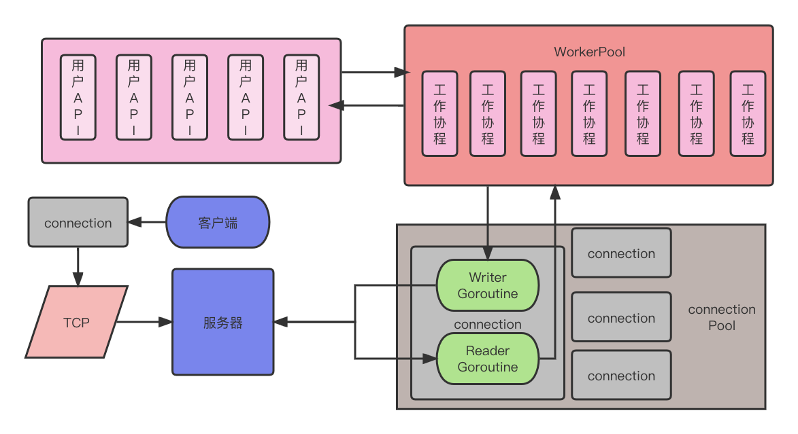

# Czinx
## **个人设计开发的轻量级TCP游戏服务器后端架构**

本项目出于满足我自己个人游戏开发的需要，由于我游戏端开发引擎使用的是GoDot，Godot的网络支持是分完善，常用的四种协议全部支持，并且在文档中提供了完整的教程，也给出了对开发者的网络协议使用建议。

> Godot始终支持通过UDP, TCP 和一些更高级别的协议(如SSL和HTTP)进行标准的低级网络连接. 这些协议非常灵活, 几乎可以用于任何事情. 然而, 使用它们来手动同步游戏状态可能需要大量的工作. 有时这种工作是无法避免的, 或者是值得的, 例如在后台使用自定义服务器实现时. 但在大多数情况下, 考虑Godot的高级网络API是值得的, 它牺牲了对低级网络的一些细粒度控制, 以获得更大的易用性
>
> 一般来说,TCP 可以被认为是可靠的, 有序的和缓慢的; UDP则是不可靠, 无序, 但是速度快. 由于性能上的巨大差异, 在避免不需要的部分(拥塞/流量控制特性, Nagle算法等)的同时, 重新构建游戏所需的TCP部分(可选的可靠性和包顺序)通常是合理的. 正因为如此, 大多数游戏引擎都带有这样的实现,Godot也不例外.

### TODO：

1. websocket协议支持
2. 加入logrus、viper等框架集成使用

### 特点

特点：轻量级，实现TCP长连接通信，高并发，高度自由的面相接口应用开发

### 架构图：

架构设计：

#### 实现长连接：

完成tcp连接后，

### 解决兵法

### 关于协议的选择理由

#### **TCP：**

优点：可靠性、全双工协议、开源支持多、应用较广泛、面向连接、研发成本低、报文内容不限制（IP层自动分包，重传，不大于1452bytes）

缺点：操作系统：较耗内存，支持连接数有限、设计：协议较复杂，自定义应用层协议、网络：网络差情况下延迟较高、传输：效率低于UDP协议

特性：面向连接、可靠性、全双工协议、基于IP层、OSI参考模型位于传输层、适用于二进制传输

#### **UDP**

优点：操作系统：并发高，内存消耗较低、传输：效率高，网络延迟低、传输模型简单，研发成本低

缺点：协议不可靠、单向协议、开源支持少、报文内容有限，不能大于1464bytes、设计：协议设计较复杂、网络：网络差，而且丢数据报文

特性：无连接，不可靠，基于IP协议层，OSI参考模型位于传输层，最大努力交付，适用于二进制传输

#### **HTTP：**

优点：协议较成熟，应用广泛、基于TCP/IP，拥有TCP优点、研发成本很低，开发快速、开源软件较多，nginx,apache,tomact等

缺点：无状态无连接、只有PULL模式，不支持PUSH、数据报文较大

特性：基于TCP/IP应用层协议、无状态，无连接、支持C/S模式、适用于文本传输

#### **WebSocket**

优点：协议较成熟、基于TCP/IP，拥有TCP优点、数据报文较小，包头非常小、面向连接，有状态协议、开源较多，开发较快

缺点：没发现啥缺点

特性：有状态，面向连接、数据报头较小、适用于WEB3.0，以及其他即时联网通讯

UDP协议最方便快捷，但是安全性最低，在对实时性、丢包率有要求的游戏中很难满足要求，Http无状态无连接，数据报文比较长，而且不支持全双工，服务器不能主动给客户端发消息。TCP面向连接，更稳定，也更难实现并发，报文开销更大，WebSocket目前看来像一个比较完美解决方案。也准备下一步完成对WebSocket协议的支持。

协议：Tcp
TCP协议的优点

