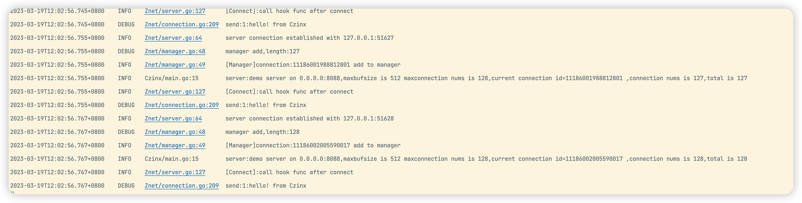

# Czinx
## **个人设计开发的轻量级TCP游戏服务器后端架构**

本项目出于满足我自己个人游戏开发的需要，由于我游戏端开发引擎使用的是GoDot，Godot的网络支持是分完善，常用的四种协议全部支持，并且在文档中提供了完整的教程，也给出了对开发者的网络协议使用建议。

> Godot始终支持通过UDP, TCP 和一些更高级别的协议(如SSL和HTTP)进行标准的低级网络连接. 这些协议非常灵活, 几乎可以用于任何事情. 然而, 使用它们来手动同步游戏状态可能需要大量的工作. 有时这种工作是无法避免的, 或者是值得的, 例如在后台使用自定义服务器实现时. 但在大多数情况下, 考虑Godot的高级网络API是值得的, 它牺牲了对低级网络的一些细粒度控制, 以获得更大的易用性
>
> 一般来说,TCP 可以被认为是可靠的, 有序的和缓慢的; UDP则是不可靠, 无序, 但是速度快. 由于性能上的巨大差异, 在避免不需要的部分(拥塞/流量控制特性, Nagle算法等)的同时, 重新构建游戏所需的TCP部分(可选的可靠性和包顺序)通常是合理的. 正因为如此, 大多数游戏引擎都带有这样的实现,Godot也不例外.


### TODO：

1. websocket协议支持
2. ~~加入logrus、viper等框架集成使用~~
3. 完成消息内容部分ProtoBuf的封装
4. ~~完成连接管理器的LRU策略~~

已经集成Zap日志框架，实现日志分级输出，错误日志输出到文件中，大部分日志输出到终端中。通过zap.L获取全局日志输出。

```go
zap.L().Info()//Debug()Panic()Error()
```


### 特点

特点：轻量级，实现TCP长连接通信，高并发，高度自由的面相接口开发


项目目录结构

1. `Zinterface`接口
2. `zNet`核心功能
3. `config`配置文件
4. `utils`工具包

```bash
Czinx
├── Demo
├── README.md
├── Zinterface
├── Znet
│   ├── client.go
│   ├── connection.go
│   ├── datapack.go
│   ├── handleRouter.go
│   ├── manager.go
│   ├── message.go
│   ├── msgHandle.go
│   ├── request.go
│   ├── router.go
│   ├── server.go
│   └── server_test.go
├── config
│   └── config.json
├── log
├── main.go
├── pics
└── utils
    ├── config.go
    ├── logger.go
    └── sonyFlake.go
```


### 架构图：


### 使用

下载安装

```bash
go get github.com/DoChEnGzZ/Czinx
```

配置服务器`config/config.json`

1. `MaxPackageSize`最大包长，不包含包头

2. `MaxWorkPoolSize`最大处理协程数，请设置适合自己CPU的数字

3. `MaxConn`最大连接数，当出现超过最大连接数的连接时会调用LRU模块，断开最近未联系的连接，以满足最新的连接需求。

4. `MaxPoolTaskSiz`每个协程最大可接受任务数，令牌桶的令牌数也会按此设置

   

```json
{
  "Name":"demo server",
  "Host":"0.0.0.0",
  "TcpPort":8080,
  "MaxPackageSize": 512, 
  "MaxConn":        1024, 
  "MaxWorkPoolSize": 10, 
  "MaxPoolTaskSize": 512 
}
```
启动服务器
```go
	s:=Znet.NewServer("test") //传入服务器名
	go s.Serve()
```

为服务器注册业务，每个业务对应不同的消息id

BaseRouter是个基础业务处理模块，会将从客户端收到的消息打印在日志中

```go
	s.AddRouter(0,Znet.NewBaseRouter("client 0 test message"))
	s.AddRouter(1,Znet.NewBaseRouter("client 1 test message"))
```

可以自定义处理路由，像Gin一样。

```go
	var msgId uint32
	server.AddRouter(msgId, HandleRouter{})
	type HandleRouter struct{}

//处理前
func (HandleRouter) PreHandle(requestInterface Zinterface.RequestI) {
	panic("implement me")
}

//处理中
func (HandleRouter) Handle(requestInterface Zinterface.RequestI) {
	panic("implement me")
}

//处理后
func (HandleRouter) PostHandle(requestInterface Zinterface.RequestI) {
	panic("implement me")
}
```

启动客户端,制定服务器地址和端口号：

```go
	c:=Znet.NewClient("127.0.0.1",8080)
```

实现go客户端仅供测试使用。

启动客户端并且发送测试消息

```go
	c.Start()
	c.SendMessage(1,"https")
```

目前定义的TCP消息格式：

头8字节为数据头，包含消息长度和消息id，消息部分可以自定义格式，序列化Json、ProtoBuf都可以。

```go
/*|DataLen**|MessageID|Data|*/
/*|***4Byte*|**4Byte**|*/
```


### 并发测试:

#### 多连接测试：

1. 用tcpkali同时开256的tcp连接，设置tcp连接上限数目为1024，在不超过连接上限的情况下可以轻松建立


2. 设置连接上限为128，先进行128次连接，塞满connectionManager的管理上限。然后再进行30次连接建立，可以看到总连接数维持在128，但是连接计数到了158，中间日志显示断开了最一开始的30个TCP连接。




#### 多消息压力测试

### 关于协议的选择理由

#### **TCP：**

优点：可靠性、全双工协议、开源支持多、应用较广泛、面向连接、研发成本低、报文内容不限制（IP层自动分包，重传，不大于1452bytes）

缺点：操作系统：较耗内存，支持连接数有限、设计：协议较复杂，自定义应用层协议、网络：网络差情况下延迟较高、传输：效率低于UDP协议

特性：面向连接、可靠性、全双工协议、基于IP层、OSI参考模型位于传输层、适用于二进制传输

#### **UDP**

优点：操作系统：并发高，内存消耗较低、传输：效率高，网络延迟低、传输模型简单，研发成本低

缺点：协议不可靠、单向协议、开源支持少、报文内容有限，不能大于1464bytes、设计：协议设计较复杂、网络：网络差，而且丢数据报文

特性：无连接，不可靠，基于IP协议层，OSI参考模型位于传输层，最大努力交付，适用于二进制传输

#### **HTTP：**

优点：协议较成熟，应用广泛、基于TCP/IP，拥有TCP优点、研发成本很低，开发快速、开源软件较多，nginx,apache,tomact等

缺点：无状态无连接、只有PULL模式，不支持PUSH、数据报文较大

特性：基于TCP/IP应用层协议、无状态，无连接、支持C/S模式、适用于文本传输

#### **WebSocket**

优点：协议较成熟、基于TCP/IP，拥有TCP优点、数据报文较小，包头非常小、面向连接，有状态协议、开源较多，开发较快

缺点：没发现啥缺点

特性：有状态，面向连接、数据报头较小、适用于WEB3.0，以及其他即时联网通讯

UDP协议最方便快捷，但是安全性最低，在对实时性、丢包率有要求的游戏中很难满足要求，Http无状态无连接，数据报文比较长，而且不支持全双工，服务器不能主动给客户端发消息。TCP面向连接，更稳定，也更难实现并发，报文开销更大，WebSocket目前看来像一个比较完美解决方案。也准备下一步完成对WebSocket协议的支持。


